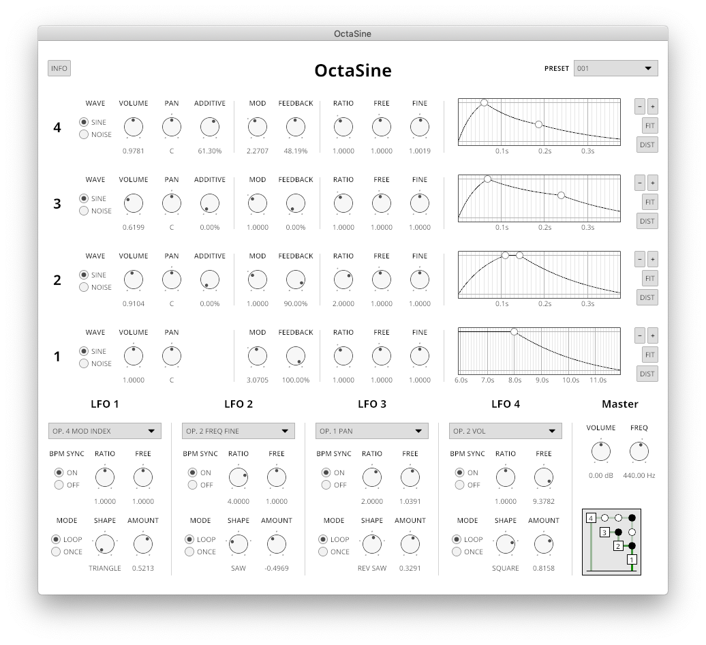

# OctaSine

VST2 frequency modulation synthesizer written in Rust.

Audio examples are available at [soundcloud.com/octasine](https://soundcloud.com/octasine).

## Screenshot



## About

* Four operators with independent parameters such as volume, panning,
  modulation index, feedback, three different frequency modifiers (ratio, free
  and fine) and ADSR volume envelope parameters. The operators can be
  independently switched to white noise mode
* Flexible routing allowing setting the output operator (with some
  limitations) as well as the percentage of signal that is simply added to the
  final output, enabling additive synthesis. By default, operator 4 is routed
  to operator 3, operator 3 to operator 2 and operator 2 to operator 1.
* Master volume and master frequency parameters
* Four LFOs capable of targeting most operator parameters as well as
  most parameters of lower index LFOs.
* 128 voices (using them all simultaneously might consume quite a bit
  of CPU time though)
* Fully automatable

## Installation

### macOS

1. Download the latest version from [the release page](https://github.com/greatest-ape/OctaSine/releases).
2. Unzip the file.
3. Move OctaSine.vst to your plugin folder, which is typically `/Library/Audio/Plug-Ins/VST/`. You may be promted to enter your administrative password.

### Windows

1. Download the latest version from [the release page](https://github.com/greatest-ape/OctaSine/releases).
2. Unzip the file.
3. Move OctaSine.dll to your plugin folder. You may be promted to enter your administrative password.

### Linux

Please refer to the section on installing from source below.

## Installation from source code

### macOS

If you already have any of the software mentioned below, that step can be skipped.

1. [Install the Rust compiler](https://rustup.rs/). Choose the nightly toolchain when prompted. Requires the XCode build tools from Apple, you will probably be prompted to install those.

2. If you didn't install the nightly Rust toolchain in the last step, do it now:

```sh
rustup toolchain install nightly
```

3. [Install homebrew](https://brew.sh).

4. Install git and cmake with homebrew:

```sh
brew install git cmake
```

5. Clone this repository to a folder on your computer:

```sh
mkdir -p "$HOME/Downloads"
cd "$HOME/Downloads"
git clone https://github.com/greatest-ape/OctaSine.git
cd OctaSine
```

6. Build and install:

```sh
./scripts/macos/build-simd-and-install.sh
```

### Windows

If you already have any of the software mentioned below, that step can be skipped.

1. Install [Microsoft C++ Build Tools](https://visualstudio.microsoft.com/visual-cpp-build-tools/). Make sure that the Windows 10 SDK and the English language pack components are included during installation.
2. [Install the Rust compiler](https://rustup.rs/). When prompted, choose to modify the path variable.
4. Install [git](https://git-scm.com/downloads).
5. Clone this repository to a folder on your computer.
6. Build the OctaSine plugin:

```sh
cargo build --release -p octasine_vst2_plugin
```

7. Copy `target\release\octasine.dll` to your VST plugin folder.

#### SIMD support

If you want SIMD support for better performance, before compiling OctaSine, you need to:
* Install the nightly Rust toolchain instead.
* Install the prerequisites for a non-simd install outlined above.
* Install [cmake](https://cmake.org/download/). When prompted, choose the option to add cmake to the system executable path.
* Build and install [LLVM](https://github.com/llvm/llvm-project/) __from source__.

Then, build OctaSine with:

```sh
cargo +nightly build --release --features "simd" -p octasine_vst2_plugin
```

### Linux

If you already have any of the software mentioned below, that step can be skipped.

1. [Install the Rust compiler](https://rustup.rs/). Choose the nightly toolchain when prompted. 
2. Install dependencies, e.g.,

```sh
sudo apt-get install cmake git build-essential libx11-dev libxcursor-dev libxcb-dri2-0-dev libxcb-icccm4-dev libx11-xcb-dev
```

3. Clone this repository to a folder on your computer, e.g.,

```sh
mkdir -p "$HOME/Downloads"
cd "$HOME/Downloads"
git clone https://github.com/greatest-ape/OctaSine.git
cd OctaSine
```
4. Build the OctaSine plugin:

```sh
cargo +nightly build --release --features "simd" -p octasine_vst2_plugin
```

5. Copy `target/release/liboctasine.so` to your VST plugin folder 

## Copyright and license

Copyright (C) 2019-2021 Joakim Frostegård

OctaSine is licensed under the GNU Affero General Public License, Version 3, as
published by the Free Software Foundation. See [LICENSE](LICENSE) for details.

Contents of the `contrib` directory are licensed under other terms. Please
refer to the contained directories and/or files for details.

## Trivia

* The name OctaSine comes from the four stereo sine-wave operators
